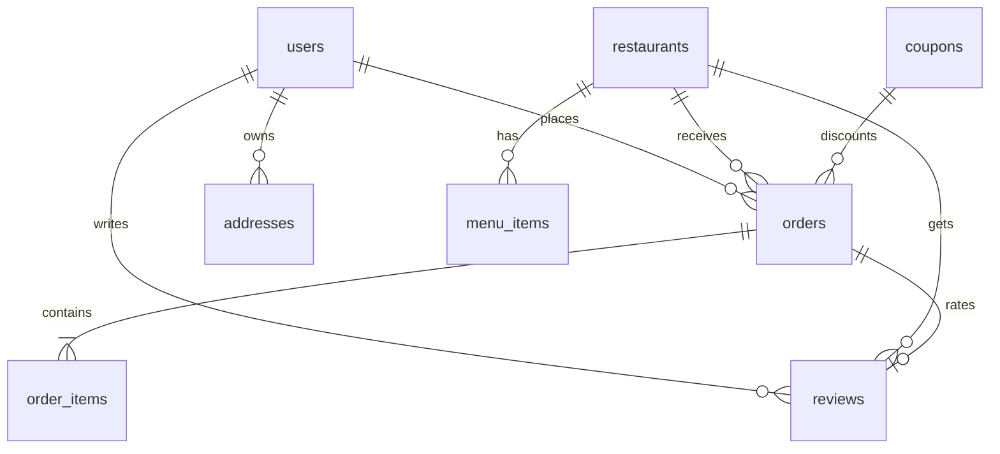

# What If — Discover The Best Food & Drinks 🍕

Welcome to the **"What If"** food delivery platform (Zomato/Swiggy style) engineered with Vanilla JS, PHP Sessions, and PostgreSQL PDO. This project serves a complete, high-performance web experience packaged in both a **dynamic database-driven system (`index.php`)** and a **portable static prototype (`index.html`)** for testing and seamless onboarding. It also features a custom-built, interactive **PostgreSQL Database Explorer (`db-viewer.php`)** to query and view live table data right inside your web browser.

---

## 🎨 Premium Visual Elements Included
The platform has been redesigned from the ground up to follow modern web design principles (Nunito + DM Sans typography, HSL tailored vibrant color tones, and micro-interactions):

1. **Skeleton Pulse Screens**: Renders gray-gradient pulse states during search results and menu query resolutions.
2. **Back to Top Button**: Scans scrolls, fading in past `400px` to smooth-scroll users back to `0,0` viewport coordinates.
3. **WhatsApp Floating Support**: Floating green badge at bottom-left linking users to instant simulated customer care.
4. **Visual Order Progress Steps**: Active state indicators showing checkout stages (`Placed → Confirmed → Preparing → Out for Delivery → Delivered`) with pulse glow keyframes.
5. **Smooth Page Transitions**: Fades pages in and out during route switching to minimize cognitive load.
6. **Mobile Collapsible Hamburger**: Automatically collapses navigation menus on screens `< 480px` into an animated vertical layout.
7. **Fluid Typography & clamp()**: Fluid gaps, sizes, and padding scaling dynamically with screen widths across three responsive breakpoints (`480px`, `768px`, `1024px`).
8. **Backdrop Closures**: Listening triggers closing modals and side-drawers automatically when clicking anywhere on overlay backdrops.
9. **Real-time Order Progress Tracking**: Dynamically simulates order preparation and delivery in the background every 10 seconds. Advances the status automatically from `Placed` to `Delivered` in the PostgreSQL database via AJAX, complete with live color-changing visual milestones and progress bar updates.
10. **Self-Healing Database Seeding**: Detects if critical popular items (like "Chicken Burger" or "Pav Bhaji") are missing and dynamically seeds them upon visiting `index.php`, ensuring every search query has valid matches.

---

## 🏗️ System Architecture & Database Schema

> [!IMPORTANT]
> **Database Engine**: The application utilizes a **PostgreSQL** database named **`whatif_db`**. 
> To initialize the application, you must first create the empty database (e.g. `CREATE DATABASE whatif_db;`) in PostgreSQL. When you first visit `index.php`, the system will automatically run schema migrations, create all tables, and seed them with premium Bangalore food ordering data.

The database model is designed with strict data integrity, foreign keys, and cascading deletes.



### Detailed Table Specifications (`whatif_db` database)

#### 1. `users` — Account management table
*   `id` (BIGSERIAL, PRIMARY KEY): Unique auto-incrementing identifier.
*   `name` (VARCHAR(255), NOT NULL): Full name of the user.
*   `phone` (VARCHAR(20), UNIQUE): Unique mobile number.
*   `email` (VARCHAR(255), UNIQUE): Unique email address.
*   `otp` (VARCHAR(10), DEFAULT NULL): active 6-digit session validation OTP.
*   `otp_expires` (TIMESTAMP, DEFAULT NULL): Expiration time bounds of the generated OTP.
*   `created_at` (TIMESTAMP, DEFAULT NOW()): Account registration timestamp.

#### 2. `restaurants` — Gourmet dining kitchens
*   `id` (BIGSERIAL, PRIMARY KEY): Unique auto-incrementing identifier.
*   `name` (VARCHAR(255), NOT NULL): Restaurant brand name.
*   `cuisine` (VARCHAR(255), NOT NULL): Comma-separated food styles.
*   `image` (TEXT, NOT NULL): Dining header visual thumbnail URI.
*   `rating` (NUMERIC(2,1), DEFAULT 4.0): Cumulative user feedback rating out of `5.0`.
*   `delivery_time` (INT, DEFAULT 30): Expected delivery duration in minutes.
*   `min_order` (INT, DEFAULT 0): Minimum subtotal requirement for orders.
*   `delivery_fee` (INT, DEFAULT 29): Standard delivery partner fee in INR.
*   `is_open` (BOOLEAN, DEFAULT TRUE): Store kitchen availability indicator.
*   `offer_text` (VARCHAR(255), DEFAULT NULL): Custom deal overlay banner text.

#### 3. `menu_items` — Restaurant dishes catalog
*   `id` (BIGSERIAL, PRIMARY KEY): Unique auto-incrementing identifier.
*   `restaurant_id` (BIGINT, FK REFERENCES `restaurants` ON DELETE CASCADE): Target kitchen mapping.
*   `name` (VARCHAR(255), NOT NULL): Culinary dish name.
*   `description` (TEXT): Ingredients and serving info.
*   `price` (INT, NOT NULL): Item base cost in INR.
*   `image` (TEXT, DEFAULT NULL): Dish photography banner URI.
*   `type` (VARCHAR(3), DEFAULT 'veg'): Categorization tag (`veg` or `nv`).
*   `category` (VARCHAR(100), NOT NULL): Menu grouping section (e.g. `🔥 Bestsellers`).
*   `is_available` (BOOLEAN, DEFAULT TRUE): Dish order availability toggle.

#### 4. `orders` — Billing checkout records
*   `id` (BIGSERIAL, PRIMARY KEY): Unique auto-incrementing identifier.
*   `user_id` (BIGINT, FK REFERENCES `users` ON DELETE CASCADE): Customer billing identity.
*   `restaurant_id` (BIGINT, FK REFERENCES `restaurants` ON DELETE CASCADE): Restaurant provider.
*   `status` (VARCHAR(30), DEFAULT 'Placed'): Order tracking state (`Placed`, `Confirmed`, `Preparing`, `Out for Delivery`, `Delivered`).
*   `subtotal` (INT, NOT NULL): Aggregated items base total in INR.
*   `delivery_fee` (INT, NOT NULL): Applied delivery partner surcharge.
*   `gst` (INT, NOT NULL): Standard GST rate subtotal (5%).
*   `discount` (INT, DEFAULT 0): Saved amount via coupons.
*   `total` (INT, NOT NULL): Final payable total.
*   `address` (TEXT, NOT NULL): Textual delivery location path.
*   `created_at` (TIMESTAMP, DEFAULT NOW()): Timestamp log.

#### 5. `order_items` — Nested transaction records
*   `id` (BIGSERIAL, PRIMARY KEY): Unique auto-incrementing identifier.
*   `order_id` (BIGINT, FK REFERENCES `orders` ON DELETE CASCADE): Parent checkout receipt link.
*   `item_id` (BIGINT, DEFAULT NULL): Reference link to dish database.
*   `name` (TEXT, NOT NULL): Purchased dish name.
*   `price` (INT, NOT NULL): Cost per unit at checkout.
*   `qty` (INT, DEFAULT 1): Quantity purchased.

#### 6. `coupons` — Promotional campaign codes
*   `id` (BIGSERIAL, PRIMARY KEY): Unique auto-incrementing identifier.
*   `code` (VARCHAR(20), UNIQUE NOT NULL): Coupon text key (e.g. `WELCOME40`).
*   `discount_type` (VARCHAR(10), NOT NULL): Reduction type (`pct` for percentage, `flat` for INR subtraction).
*   `discount_value` (INT, NOT NULL): Reduction value mapping.
*   `min_order` (INT, DEFAULT 0): Minimum cart requirement.
*   `max_uses` (INT, DEFAULT 9999): Maximum allowed globally.
*   `used_count` (INT, DEFAULT 0): Global usage logging metrics.
*   `expires_at` (TIMESTAMP, DEFAULT NULL): Expiry boundary timestamp.

---

## 📊 PostgreSQL Database Explorer (`db-viewer.php`)

To make exploring your database schemas and live data extremely convenient, we have included a custom developer tool called **PostgreSQL Database Explorer**:

*   **No Configuration Needed**: It automatically parses your database settings directly from `index.php`.
*   **Visual Side Panel**: Lists all 8 system tables alongside their live row counts.
*   **Live Data Explorer**: Inspect the first 100 rows inside any table with dynamic, key-triggered data searching and real-time results.
*   **Schema & Constraints View**: Quickly toggle to inspect column details, primary keys, schemas, and constraint configurations.
*   **Light Theme & Professional Corporate Palette**: Restyled with a premium light off-white layout using royal blue, emerald green, and teal highlights to make data analysis clean and strain-free.
*   **How to Access**: Launch XAMPP, start Apache, and visit: `http://localhost/what_if01/db-viewer.php`

---

## 🔌 API Endpoints Catalog (`index.php?action=...`)

All network calls communicate asynchronously via JSON formatted payloads.

| Action Endpoint | HTTP Method | Expected Inputs | Success Response Structure |
| :--- | :--- | :--- | :--- |
| `login_send_otp` | `POST` | `phone` (optional), `email` (optional) | `{"success": true, "otp": "6-digit-otp", "msg": "OTP generated..."}` |
| `login` | `POST` | `phone`/`email`, `otp` | `{"success": true, "user": {"id": 1, "name": "..."}}` |
| `register_send_otp`| `POST` | `name`, `email`, `phone`, `password` | `{"success": true, "otp": "6-digit-otp"}` |
| `register` | `POST` | `otp` | `{"success": true, "user": {"id": 1, "name": "..."}}` |
| `logout` | `POST` | None | `{"success": true}` |
| `get_restaurants` | `GET` | `q` (search key), `cuisine`, `rating`, `sort`| `[{"id": 1, "name": "Truffles", "cuisine": "..."}, ...]` |
| `get_menu` | `GET` | `restaurant_id` | `{"🔥 Bestsellers": [{"id": 1, "name": "Classic Cheeseburger", ...}], ...}` |
| `place_order` | `POST` | `restaurant_id`, `subtotal`, `delivery_fee`, `gst`, `discount`, `total`, `address`, `coupon_code`, `items` (JSON string) | `{"success": true, "order_id": 45, "msg": "Order placed..."}` |
| `get_orders` | `GET` | None (requires Session `user`) | `[{"id": 45, "total": 450, "items": [{"name": "...", "qty": 1}], ...}, ...]` |
| `update_order_status` | `POST` | `order_id`, `status` | `{"success": true, "order_id": 45, "status": "Preparing"}` |

---

## 🚀 Setup & Launch Instructions

### 1. Fast Portable Prototype (Zero Setup)
The static edition is completely self-contained and runs instantly without any server or database configurations.
1. Open [index.html](file:///c:/Users/prem/Desktop/what_if01/index.html) in any modern web browser.
2. Sign up or log in, view the simulated OTP floating card in the bottom-right, and explore cart checkouts, visual step-progress tracking, and meal feedback.

### 2. Built-in PHP Server Method (Fastest Dynamic Startup)
If you already have PHP and PostgreSQL installed locally, this is the quickest method to run the dynamic version.
1. Ensure your local PostgreSQL server is active.
2. Open a terminal/command prompt inside the `what_if01` directory.
3. Start the lightweight built-in PHP web server:
   ```bash
   php -S localhost:8000
   ```
4. Visit `http://localhost:8000/index.php` in your web browser. The backend will instantly connect, auto-create the database schemas, and seed menus.

### 3. Local Web Server Environment Method (XAMPP)
For a complete local server admin dashboard experience:
1. Copy the `what_if01` project folder into your server's web root (e.g. `C:/xampp/htdocs/what_if01` for XAMPP).
2. **Install PostgreSQL Client Drivers in XAMPP**:
   * Open the **XAMPP Control Panel**.
   * Click **Config** next to **Apache** and select **PHP (php.ini)**.
   * Search for `;extension=pdo_pgsql` and `;extension=pgsql` and remove the semicolons (`;`) at the beginning to uncomment them:
     ```ini
     extension=pdo_pgsql
     extension=pgsql
     ```
   * Save the file.
3. **Ensure `libpq.dll` is Loaded**:
   * Add `C:\xampp\php` to your Windows System **PATH** environment variables, or open Apache's config (`httpd.conf`) in XAMPP and append:
     ```apache
     LoadFile "C:/xampp/php/libpq.dll"
     ```
4. **Configure Database Connection**:
   * Open `index.php` in a text editor to update your PostgreSQL password around line 20:
     ```php
     define('DB_PASS', 'your_actual_password');
     ```
5. **Create the Database**:
   * Open pgAdmin 4 or psql, and create your database:
     ```sql
     CREATE DATABASE whatif_db;
     ```
6. **Launch & Enjoy**:
   * Restart Apache in the XAMPP Control Panel.
   * Access the portal at `http://localhost/what_if01/index.php`. All tables and mock data are auto-generated on your first load!
   * Access your data live at `http://localhost/what_if01/db-viewer.php`.

---

## 🛠️ Code Structure Sections
The project is structurally structured with clear block comments to simplify editing:
*   `db-viewer.php` — Seamless glassmorphic developer console to view database tables and schemas dynamically.
*   `index.php` — Core dynamic application containing session controls, database migrations, premium seeder data, and AJAX router handlers.
*   `index.html` — Portable static prototype for rapid interface testing and client presentations.

