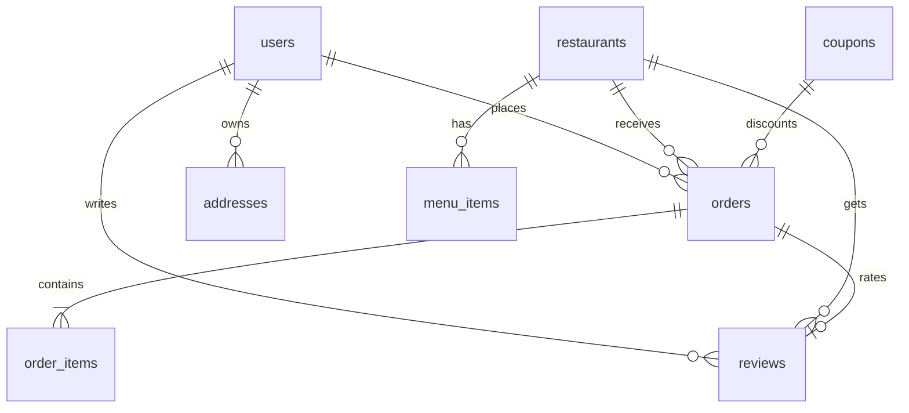

# What If — Discover The Best Food & Drinks 🍕

Welcome to the **"What If"** food delivery platform (Zomato/Swiggy style) engineered with Vanilla JS, PHP Sessions, and MySQL PDO. This project serves a complete, high-performance web experience packaged in both a **dynamic database-driven system (`index.php`)** and a **portable static prototype (`index.html`)** for testing and seamless onboarding.

---

## 🎨 Premium Visual Elements Included
The platform has been redesigned from the ground up to follow modern web design principles (Nunito + DM Sans typography, HSL tailored vibrant color tones, and micro-interactions):

1. **Skeleton Pulse Screens**: Renders gray-gradient pulse states during search results and menu query resolutions.
2. **Back to Top Button**: Scans scrolls, fading in past `400px` to smooth-scroll users back to `0,0` viewport coordinates.
3. **WhatsApp Floating Support**: Floating green badge at bottom-left linking users to instant simulated customer care.
4. **Visual Order Progress Steps**: Active state indicators showing checkout stages (`Placed → Confirmed → Preparing → Out for Delivery → Delivered`) with pulse glow keyframes.
5. **Smooth Page Transitions**: Fades pages in and out during route switching to minimize cognitive load.
6. **Mobile Collapsible Hamburger**: Automatically collapses navigation menus on screens `< 480px` into an animated vertical layout.
7. **Fluid Typography & clamp()**: Fluid gaps, sizes, and padding scaling dynamically with screen widths across three responsive breakpoints (`480px`, `768px`, `1024px`).
8. **Backdrop Closures**: Listening triggers closing modals and side-drawers automatically when clicking anywhere on overlay backdrops.

---

## 🏗️ System Architecture & Database Schema

> [!NOTE]
> **Database Name**: The application utilizes a MySQL database named **`what_if`**. 
> The database is automatically created on startup by the backend script inside `index.php` (if it does not already exist), along with all corresponding table structures and Bangalore food seed data.

The database model is designed with strict data integrity, foreign keys, and cascading deletes.



### Detailed Table Specifications (`what_if` database)

#### 1. `users` — Account management table
*   `id` (INT AUTO_INCREMENT, PRIMARY KEY): Unique identifier.
*   `name` (VARCHAR(255), NOT NULL): Full name of the user.
*   `phone` (VARCHAR(20), UNIQUE): Unique 10-digit mobile number.
*   `email` (VARCHAR(255), UNIQUE): Unique email address.
*   `otp` (VARCHAR(10), DEFAULT NULL): active 6-digit session validation OTP.
*   `otp_expires` (DATETIME, DEFAULT NULL): Expiration time bounds of the generated OTP.
*   `created_at` (TIMESTAMP, DEFAULT CURRENT_TIMESTAMP): Account registration timestamp.

#### 2. `restaurants` — Gourmet dining kitchens
*   `id` (INT AUTO_INCREMENT, PRIMARY KEY): Unique identifier.
*   `name` (VARCHAR(255), NOT NULL): Restaurant brand name.
*   `cuisine` (VARCHAR(255), NOT NULL): Comma-separated food styles.
*   `image` (VARCHAR(500), NOT NULL): Dining header visual thumbnail URI.
*   `rating` (DECIMAL(3,2), DEFAULT 4.0): Cumulative user feedback rating out of `5.0`.
*   `delivery_time` (INT, DEFAULT 30): Expected delivery duration in minutes.
*   `min_order` (INT, DEFAULT 0): Minimum subtotal requirement for orders.
*   `delivery_fee` (INT, DEFAULT 29): Standard delivery partner fee in INR.
*   `is_open` (TINYINT(1), DEFAULT 1): Store kitchen availability indicator.
*   `offer_text` (VARCHAR(255), DEFAULT NULL): Custom deal overlay banner text.

#### 3. `menu_items` — Restaurant dishes catalog
*   `id` (INT AUTO_INCREMENT, PRIMARY KEY): Unique identifier.
*   `restaurant_id` (INT, FK REFERENCES `restaurants` ON DELETE CASCADE): Target kitchen mapping.
*   `name` (VARCHAR(255), NOT NULL): Culinary dish name.
*   `description` (TEXT): Ingredients and serving info.
*   `price` (DECIMAL(10,2), NOT NULL): Item base cost.
*   `image` (VARCHAR(500), DEFAULT NULL): Dish photography banner URI.
*   `type` (VARCHAR(10), DEFAULT 'veg'): Categorization tag (`veg` or `nv`).
*   `category` (VARCHAR(100), NOT NULL): Menu grouping section (e.g. `🔥 Bestsellers`).
*   `is_available` (TINYINT(1), DEFAULT 1): Dish order availability toggle.

#### 4. `orders` — Billing checkout records
*   `id` (INT AUTO_INCREMENT, PRIMARY KEY): Unique identifier.
*   `user_id` (INT, FK REFERENCES `users` ON DELETE CASCADE): Customer billing identity.
*   `restaurant_id` (INT, FK REFERENCES `restaurants` ON DELETE CASCADE): Restaurant provider.
*   `status` (VARCHAR(50), DEFAULT 'Placed'): Order tracking state (`Placed`, `Confirmed`, `Preparing`, `Out for Delivery`, `Delivered`).
*   `subtotal` (DECIMAL(10,2), NOT NULL): Aggregated items base total in INR.
*   `delivery_fee` (DECIMAL(10,2), NOT NULL): Applied delivery partner surcharge.
*   `gst` (DECIMAL(10,2), NOT NULL): Standard GST rate subtotal (5%).
*   `discount` (DECIMAL(10,2), DEFAULT 0.00): Saved amount via coupons.
*   `total` (DECIMAL(10,2), NOT NULL): Final payable total.
*   `address` (TEXT, NOT NULL): Textual delivery location path.
*   `created_at` (TIMESTAMP, DEFAULT CURRENT_TIMESTAMP): Timestamp log.

#### 5. `order_items` — Nested transaction records
*   `id` (INT AUTO_INCREMENT, PRIMARY KEY): Unique identifier.
*   `order_id` (INT, FK REFERENCES `orders` ON DELETE CASCADE): Parent checkout receipt link.
*   `item_id` (INT, DEFAULT NULL): Reference link to dish database.
*   `name` (VARCHAR(255), NOT NULL): Purchased dish name.
*   `price` (DECIMAL(10,2), NOT NULL): Cost per unit at checkout.
*   `qty` (INT, DEFAULT 1): Quantity purchased.

#### 6. `coupons` — Promotional campaign codes
*   `id` (INT AUTO_INCREMENT, PRIMARY KEY): Unique identifier.
*   `code` (VARCHAR(50), UNIQUE NOT NULL): Coupon text key (e.g. `WELCOME40`).
*   `discount_type` (VARCHAR(20), NOT NULL): Reduction type (`pct` for percentage, `flat` for INR subtraction).
*   `discount_value` (DECIMAL(10,2), NOT NULL): Reduction value mapping.
*   `min_order` (DECIMAL(10,2), DEFAULT 0.00): Minimum cart requirement.
*   `max_uses` (INT, DEFAULT 9999): Maximum allowed globally.
*   `used_count` (INT, DEFAULT 0): Global usage logging metrics.
*   `expires_at` (DATETIME, DEFAULT NULL): Expiry boundary timestamp.

---

## 🔌 API Endpoints Catalog (`index.php?action=...`)

All network calls communicate asynchronously via JSON formatted payloads.

| Action Endpoint | HTTP Method | Expected Inputs | Success Response Structure |
| :--- | :--- | :--- | :--- |
| `login_send_otp` | `POST` | `phone` (optional), `email` (optional) | `{"success": true, "otp": "6-digit-otp", "msg": "OTP generated..."}` |
| `login` | `POST` | `phone`/`email`, `otp` | `{"success": true, "user": {"id": 1, "name": "..."}}` |
| `register_send_otp`| `POST` | `name`, `email`, `phone`, `password` | `{"success": true, "otp": "6-digit-otp"}` |
| `register` | `POST` | `otp` | `{"success": true, "user": {"id": 1, "name": "..."}}` |
| `logout` | `POST` | None | `{"success": true}` |
| `get_restaurants` | `GET` | `q` (search key), `cuisine`, `rating`, `sort`| `[{"id": 1, "name": "Truffles", "cuisine": "..."}, ...]` |
| `get_menu` | `GET` | `restaurant_id` | `{"🔥 Bestsellers": [{"id": 1, "name": "Classic Cheeseburger", ...}], ...}` |
| `place_order` | `POST` | `restaurant_id`, `subtotal`, `delivery_fee`, `gst`, `discount`, `total`, `address`, `coupon_code`, `items` (JSON string) | `{"success": true, "order_id": 45, "msg": "Order placed..."}` |
| `get_orders` | `GET` | None (requires Session `user`) | `[{"id": 45, "total": 450, "items": [{"name": "...", "qty": 1}], ...}, ...]` |
| `validate_coupon` | `POST` | `code`, `subtotal` | `{"success": true, "discount_type": "pct", "discount_value": 40, "max": 120}` |
| `submit_review` | `POST` | `order_id`, `rating`, `delivery_rating`, `comment` | `{"success": true}` |
| `get_profile` | `GET` | None (requires Session `user`) | `{"success": true, "user": {...}, "addresses": [...]}` |

---

## 🚀 Setup & Launch Instructions

### 1. Fast Portable Prototype (Zero Setup)
The static edition is completely self-contained and runs instantly without any server or database configurations.
1. Open [index.html](file:///c:/Users/prem/Desktop/what_if01/index.html) in any modern web browser.
2. Sign up or log in, view the simulated OTP floating card in the bottom-right, and explore cart checkouts, visual step-progress tracking, and meal feedback.

### 2. Built-in PHP Server Method (Fastest Dynamic Startup)
If you already have PHP and MySQL installed locally, this is the quickest method to run the dynamic version.
1. Open a terminal/command prompt inside the `what_if01` directory.
2. Ensure your local MySQL server is active.
3. Start the lightweight built-in PHP web server:
   ```bash
   php -S localhost:8000
   ```
4. Visit `http://localhost:8000` in your web browser. The backend will instantly connect, auto-create the database, set up tables, and seed menus.

### 3. Local Web Server Environment Method (XAMPP / WAMP)
For a complete server administration panel experience:
1. Copy the `what_if01` project folder into your server's web root (e.g. `C:/xampp/htdocs/what_if01` for XAMPP).
2. Launch the **Apache** and **MySQL** modules inside the server control panel.
3. Open `index.php` in a text editor to verify or modify the database connection constants:
   ```php
   define('DB_HOST', 'localhost');
   define('DB_PORT', '3306');
   define('DB_NAME', 'what_if');
   define('DB_USER', 'root');
   define('DB_PASS', '');
   ```
4. Access the portal in your browser at `http://localhost/what_if01/index.php`. All database schemas are dynamically created and populated on load.

---

## 🛠️ Code Structure Sections
Both `index.php` and `index.html` are structurally structured with clear block comments to simplify editing:
*   `<!-- PHP BACKEND -->` — Session controls, DB migrations, seeder data, and AJAX router handlers.
*   `<!-- STYLES -->` — Harmonic color vars, transitions, clamp sizes, skeletons, and mobile breakpoints.
*   `<!-- HTML -->` — Layout pages, modal dialogs, WhatsApp supports, and back-to-top buttons.
*   `<!-- SCRIPTS -->` — AJAX fetches, simulated notifications, form validation triggers, and state models.
