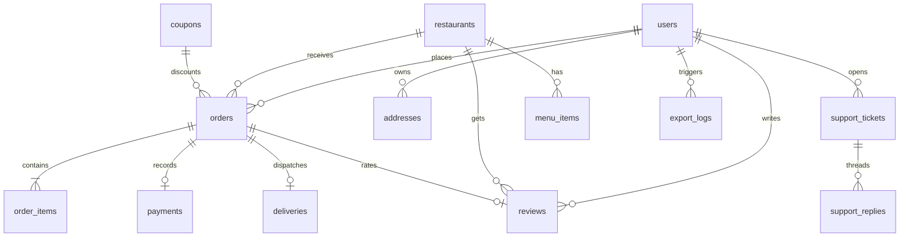

# What If — Premium Food Ordering Platform 🍕

> A production-grade, Zomato-style food delivery platform built with **PHP**, **PostgreSQL**, and **Vanilla JS**. Features a multi-role system (Customer, Restaurant Owner, Admin), a customer support ticket engine, a live analytics dashboard, and CSV data exports — all integrated into a single, self-bootstrapping codebase.

---

## ✨ Key Features

### 🛍️ Customer Experience
- OTP-based login (phone & email) with auto-account creation
- Restaurant discovery with live search, cuisine filters, and sorting
- Interactive cart drawer with coupon validation
- UPI / Card / COD checkout with real payment recording in PostgreSQL
- Live order tracking with animated progress bar (`Placed → Delivered`)
- Order history with reorder and feedback/rating system
- **Support Center** — create & track support tickets, reply to admin responses

### 👨‍💼 Admin Panel
- **Support Tickets Dashboard** — search, filter, reply, and update status
- **Reports & Analytics** — 8 live KPI counters + 6 Chart.js visualizations
- **CSV Exports** — Orders, Customers, Restaurants, Menus, Deliveries (with filters)
- All exports are logged to an audit trail (`export_logs` table)

### 🎨 Premium UI/UX
- Glassmorphic dark admin dashboard with Chart.js charts
- Skeleton pulse loading screens during AJAX data fetches
- Smooth page transitions with fade + translateY animations
- Mobile hamburger collapsible navbar with fluid typography (`clamp()`)
- Real-time order status simulation (advances every 10 seconds via AJAX)
- Self-healing DB seeder — always ensures critical demo data exists

---

## 🏗️ System Architecture

```
what_if01/
├── index.php                          ← Core SPA (DB init, AJAX router, full frontend UI)
├── dev-db-inspector.php               ← Developer-only PostgreSQL browser tool
├── README.md
│
├── includes/
│   ├── support-functions.php          ← DB migrations, role auth guards, CSRF, sanitize
│   ├── export-functions.php           ← CSV streaming, export audit logging
│   ├── mailer.php                     ← PHPMailer SMTP + HTML file fallback logger
│   └── PHPMailer/                     ← PHPMailer v6 library (Exception, PHPMailer, SMTP)
│
├── customer/
│   └── support/
│       ├── create-ticket.php          ← Submit a new support ticket
│       ├── my-tickets.php             ← List all personal tickets
│       └── ticket-details.php         ← View thread & reply
│
└── admin/
    ├── support/
    │   ├── tickets.php                ← Admin ticket list (search, filter, bulk update)
    │   └── ticket-details.php         ← Thread view, admin reply, status management
    └── reports/
        ├── index.php                  ← Analytics dashboard (Chart.js)
        ├── export-orders.php          ← Filtered orders CSV download
        ├── export-customers.php       ← Customer directory CSV download
        ├── export-restaurants.php     ← Restaurants ledger CSV download
        ├── export-menu.php            ← Menu catalog CSV download
        └── export-deliveries.php      ← Delivery audit CSV download
```

---

## 🗄️ Database Schema (`whatif_db`)

All tables are **auto-created** and **self-healed** on first load of `index.php`. No manual SQL setup required beyond creating the empty database.


```mermaid
erDiagram
    users ||--o{ orders : places
    users ||--o{ reviews : writes
    users ||--o{ addresses : owns
    users ||--o{ support_tickets : opens
    restaurants ||--o{ menu_items : has
    restaurants ||--o{ orders : receives
    restaurants ||--o{ reviews : gets
    orders ||--|{ order_items : contains
    orders ||--o| payments : records
    orders ||--o| deliveries : dispatches
    orders ||--o| reviews : rates
    support_tickets ||--o{ support_replies : threads
    coupons ||--o{ orders : discounts
    users ||--o{ export_logs : triggers
```

### Core Tables

| Table | Purpose |
|---|---|
| `users` | Accounts with `role` (Customer / Restaurant Owner / Admin) |
| `restaurants` | Dining kitchens with `owner_id` foreign key |
| `menu_items` | Food catalog with category, type (veg/nv), and availability |
| `orders` | Full checkout records with status lifecycle |
| `order_items` | Line items per order with user snapshot (name, phone, email) |
| `payments` | Transaction log (UPI / Card / COD), payment status, transaction ID |
| `deliveries` | Delivery partner assignment and completion timestamps |
| `coupons` | Promo codes with `pct`/`flat` discount types and usage caps |
| `addresses` | Saved delivery locations per user |
| `reviews` | Food + delivery ratings linked to orders |
| `support_tickets` | Customer support threads (category, priority, status) |
| `support_replies` | Threaded replies from customers and admins |
| `export_logs` | Admin CSV export audit trail (who, what, when, from which IP) |

### `users` Table (Extended Schema)
| Column | Type | Notes |
|---|---|---|
| `id` | BIGSERIAL PK | Auto-increment |
| `name` | VARCHAR(255) | Full name |
| `phone` | VARCHAR(20) UNIQUE | Mobile number |
| `email` | VARCHAR(255) UNIQUE | Email address |
| `role` | VARCHAR(20) | `Customer` / `Restaurant Owner` / `Admin` |
| `otp` | VARCHAR(10) | Active 6-digit OTP (nulled after verify) |
| `otp_expires` | TIMESTAMP | OTP validity window (5 minutes) |
| `address` | TEXT | Default delivery address |
| `created_at` | TIMESTAMP | Registration timestamp |

### `support_tickets` Table
| Column | Type | Notes |
|---|---|---|
| `id` | SERIAL PK | Auto-increment |
| `customer_id` | INT FK → users | Ticket owner |
| `order_id` | INT FK → orders | Optional related order |
| `subject` | VARCHAR(255) | Short title |
| `category` | VARCHAR(100) | Order Issue / Payment Issue / Refund Request / Restaurant Complaint / Delivery Problem / Account Issue / Other |
| `priority` | VARCHAR(20) | `Low` / `Medium` / `High` |
| `message` | TEXT | Initial description |
| `status` | VARCHAR(30) | `Open` / `In Progress` / `Resolved` / `Closed` |
| `created_at` | TIMESTAMP | Submitted timestamp |
| `updated_at` | TIMESTAMP | Last modified timestamp |

---

## 🔑 Demo Login Credentials

The following accounts are **auto-seeded** into the database on first run:

| Role | Email | Phone | OTP |
|---|---|---|---|
| **Admin** | `admin@whatif.com` | `9999999999` | Shown in popup after requesting OTP |
| **Restaurant Owner** | `owner@whatif.com` | `8888888888` | Shown in popup after requesting OTP |
| **Customer** | Any new email/phone | Any new phone | Auto-creates account, OTP shown in popup |

> The OTP simulator popup appears in the bottom-right of the screen after clicking **Send OTP** — no real SMS/email delivery needed.

---

## 🔌 API Endpoints (`index.php?action=...`)

All calls communicate asynchronously via JSON.

| Endpoint | Method | Inputs | Response |
|---|---|---|---|
| `login_send_otp` | POST | `phone` or `email` | `{"success": true, "otp": "123456"}` |
| `login` | POST | `phone`/`email`, `otp` | `{"success": true, "user": {...}}` |
| `register_send_otp` | POST | `name`, `email`, `phone` | `{"success": true, "otp": "123456"}` |
| `register` | POST | `otp` | `{"success": true, "user": {...}}` |
| `logout` | GET | — | `{"success": true}` |
| `get_restaurants` | GET | `q`, `cuisine`, `rating`, `sort` | `[{restaurant}, ...]` |
| `get_menu` | GET | `restaurant_id` | `{"Category": [{item}, ...], ...}` |
| `place_order` | POST | `restaurant_id`, `subtotal`, `gst`, `delivery_fee`, `discount`, `total`, `address`, `coupon_code`, `items` (JSON), `payment_method` | `{"success": true, "order_id": 45, "transaction_id": "TXN-..."}` |
| `get_orders` | GET | *(session required)* | `[{order + items + payment}, ...]` |
| `update_order_status` | POST | `order_id`, `status` | `{"success": true, "status": "Preparing"}` |
| `validate_coupon` | POST | `code`, `subtotal` | `{"success": true, "discount_type": "pct", "discount_value": 40}` |
| `submit_review` | POST | `order_id`, `rating`, `delivery_rating`, `comment` | `{"success": true}` |
| `get_profile` | GET | *(session required)* | `{"user": {...}, "addresses": [...]}` |

---

## 🧭 Role-Based Navigation

After login, the navigation bar dynamically adapts:

| Role | Extra Nav Links |
|---|---|
| **Customer** | `Support` → `customer/support/my-tickets.php` |
| **Restaurant Owner** | `Support` → `customer/support/my-tickets.php` |
| **Admin** | `Support` + `Tickets` → `admin/support/tickets.php` + `Reports` → `admin/reports/` |

---

## 🔒 Security Model

| Threat | Mitigation |
|---|---|
| SQL Injection | All queries use PDO prepared statements with named parameters |
| XSS | All user-supplied output escaped via `sanitize_html()` (`htmlspecialchars`) |
| CSRF | Support forms use `get_csrf_token()` / `validate_csrf_token()` |
| Unauthorized access (Customer pages) | `require_customer_auth()` — redirects to `index.php` if not logged in |
| Unauthorized access (Admin pages) | `require_admin_auth()` — redirects if `role !== Admin` |
| Unauthorized exports | `require_admin_export_auth()` — returns HTTP 403 if unauthorized |

---

## 🚀 Setup & Launch Instructions

### Prerequisites
- **PHP** ≥ 7.4 with `pdo_pgsql` and `pgsql` extensions enabled
- **PostgreSQL** ≥ 12 running locally on port `5432`
- **XAMPP** (or any local server) with Apache

### Step 1 — Enable PostgreSQL in PHP (XAMPP)
Open `php.ini` (via XAMPP → Config → PHP) and uncomment:
```ini
extension=pdo_pgsql
extension=pgsql
```
Restart Apache after saving.

### Step 2 — Create the Database
Open pgAdmin 4 or `psql` and run:
```sql
CREATE DATABASE whatif_db;
```

### Step 3 — Configure Password
Open `index.php` and update line ~20:
```php
define('DB_PASS', 'your_postgres_password');
```

### Step 4 — Place in Web Root & Launch
Copy the `what_if01` folder into `C:/xampp/htdocs/` and visit:
```
http://localhost/what_if01/index.php
```
All tables, migrations, and seed data are created **automatically on first load**.

### Alternative — PHP Built-in Server
```bash
cd what_if01
php -S localhost:8000
# Visit: http://localhost:8000/index.php
```

---

## 🛠️ Developer Tools

### PostgreSQL DB Inspector
A full-featured, interactive database browser is included:
```
http://localhost/what_if01/dev-db-inspector.php
```
- Parses DB credentials automatically from `index.php`
- Side panel shows all tables with live row counts
- Inspect first 100 rows of any table
- View full column schemas, types, constraints, and primary keys
- Real-time search/filter within results

> ⚠️ **For development use only.** Restrict access to this file in production environments.

---

## 🍽️ Seeded Restaurant Data (Bangalore)

| Restaurant | Cuisine | Rating |
|---|---|---|
| Truffles | Burgers, American, Desserts | ⭐ 4.8 |
| Natural Ice Cream | Ice Cream, Desserts, Shakes | ⭐ 4.9 |
| Malgudi Café | South Indian, Filter Coffee | ⭐ 4.7 |
| Social | Continental, North Indian, Drinks | ⭐ 4.6 |
| Meghana Foods | Biryani, Kebabs, North Indian | ⭐ 4.5 |
| The Hole in the Wall Café | Waffles, Continental | ⭐ 4.4 |
| Vasudev Adigas | South Indian, Chaat, Snacks | ⭐ 4.3 |
| Pizza Hut | Pizzas, Pastas, Garlic Breads | ⭐ 4.2 |

### Active Coupon Codes
| Code | Discount | Min Order |
|---|---|---|
| `WELCOME40` | 40% OFF | None |
| `FLASH30` | 30% OFF | None |
| `HDFC20` | 20% OFF | ₹400 |
| `WEEKEND15` | 15% OFF | ₹250 |
| `FREEDEL` | Free Delivery (₹29 OFF) | ₹299 |
| `GOPRO` | ₹50 OFF | ₹199 |

---

## 📄 License

This project is for educational and portfolio demonstration purposes.

© 2026 What If Tech Foods Limited. All rights reserved.
